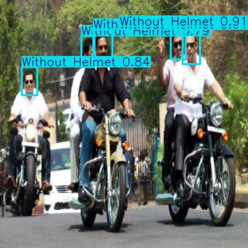
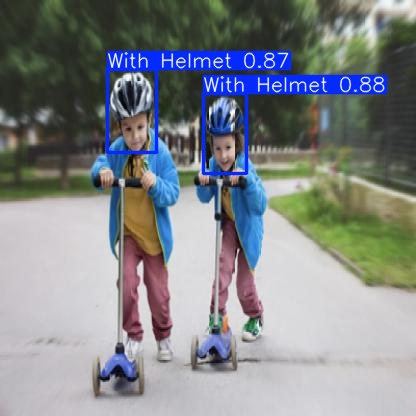

# Bike Helmet Detection – YOLOv8

Projekt wykorzystujący model YOLOv8 do detekcji kasków. Notebook `yolo_train.ipynb` zawiera pełny proces przygotowania danych, trenowania modelu, walidacji oraz wykonywania predykcji.

## Opis projektu

Celem projektu jest stworzenie modelu detekcji obiektów na podstawie niestandardowego zbioru danych przygotowanego w formacie YOLOv8. Notebook przeprowadza przez wszystkie etapy pracy z modelem: instalację, wczytanie danych, trening, ocenę skuteczności oraz generowanie predykcji.

## przykładowe wyniki modelu

### Detekcje – osoby bez kasku

### Detekcje – osoby w kasku

### Macierz pomyłek

